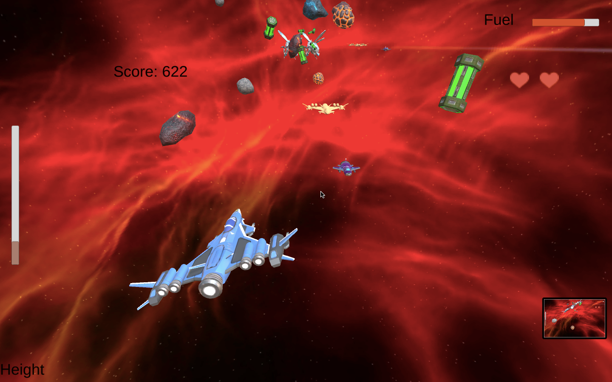

# Zaxxon3D

Zaxxon (ザクソン) is a 1982 isometric shooter arcade game, developed and released by Sega, in which the player pilots a ship through heavily defended space fortresses.

 

## Webgl Build

https://drive.google.com/drive/folders/17qwbOyytnWM383AK4vZpSnJbMN6pcYEc

## Source code:

https://drive.google.com/drive/folders/1GKKLPwRHSJ0hyRjyuuvOyCbLbfdhVBH0

## Play on web:

http://www.cse.iitd.ac.in/~shubhankar/TA/COP701/hitesh_meraj/index.html
